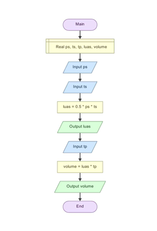

# Menghitung Volume Prisma Segitiga Siku-Siku

## Deskripsi Program
Program ini adalah penghitung volume prisma segitiga siku-siku yang dibuat menggunakan bahasa pemrograman C++.

## Flowchart Program

