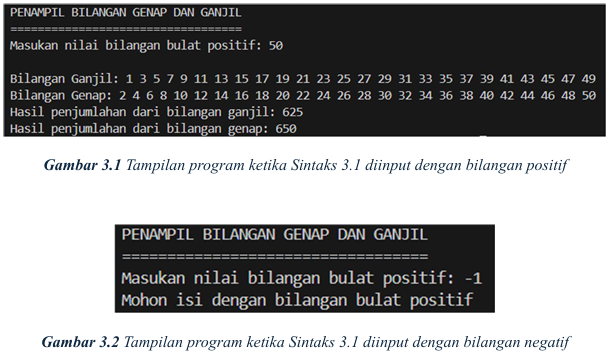

# Menampilkan Bilangan Genap Dan Ganjil Serta Menghitung Jumlahnya 

## Deskripsi Program
Program ini adalah penampil bilangan genap dan ganjil serta menghitung jumlahnya yang dibuat menggunakan bahasa pemrograman C++.

## Hasil Program

